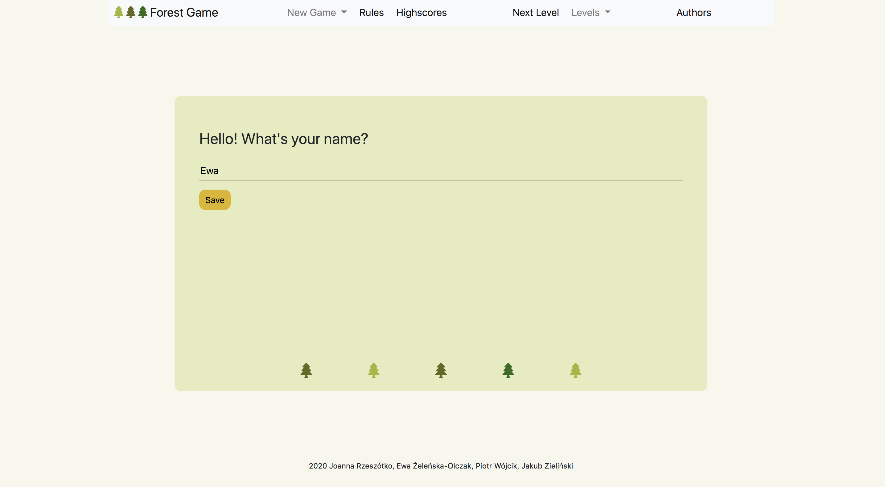
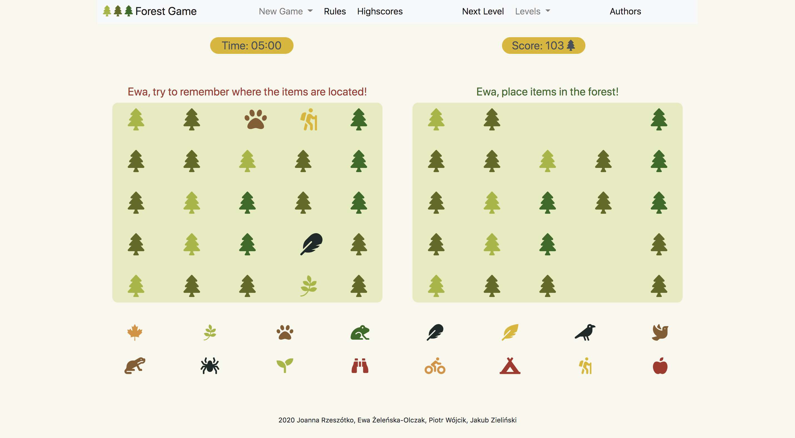

# Freestyle JavaScript Game

_Project developed in November 2020 (group project during Codecool course)_
_Developers: Ewa Żeleńska-Olczak, Joanna Rzeszótko-Doniec, Jakub Zieliński, Piotr Wójcik_

## Project assumptions
- Memory-style game: on the first board a few cards from the whole forest are uncovered
- Player has limited time to remember all of them before they are covered
- The goal is to drag and drop a proper icons from bottom line to proper location
- User can 'buy' a hint
- After putting the icons in right places next board is shown. This time is a harder one!
- How many boards can you solve within 2 minutes?
